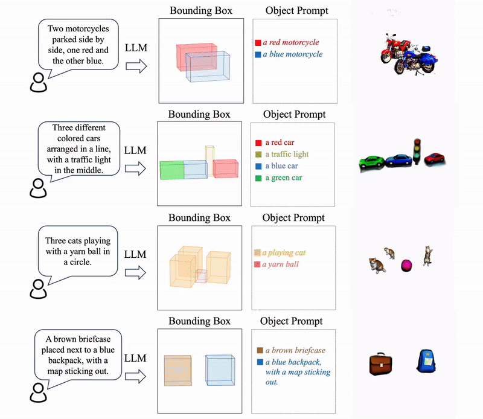

# LucidDreaming

[ArXiv Link](https://arxiv.org/abs/2312.00588) | [Project Webpage](https://www.zhaoningwang.com/LucidDreaming/)

## Overview
This repository provides scripts for generating 3D shapes and scenes with the LucidDreaming pipeline. The code is based on threestudio and the original implementation can be found [here](https://github.com/threestudio-project/threestudio).

## Dataset
The main dataset is separated into two subsets, complex and normal. The prompt used to generate each sample is in the filename of the text files. The location of the dataset is at:

objects/multi_gen

## Run Script
Use the run script to start a training or inference job:

```bash
bash scripts/multi_gen/run.sh
```

You can find the specific arguments in the top of the run script.


## Demo Videos
Some demo results:




## BibTeX

```bibtex
@article{wang2023luciddreaming,
  title={LucidDreaming: Controllable Object-Centric 3D Generation},
  author={Wang, Zhaoning and Li, Ming and Chen, Chen},
  journal={arXiv preprint arXiv:2312.00588},
  year={2023}
}
```
